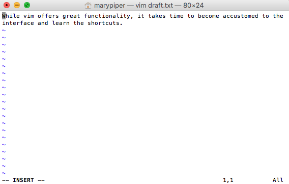
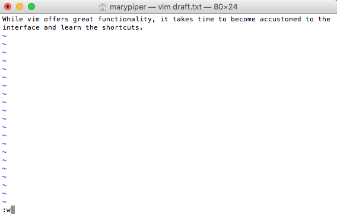
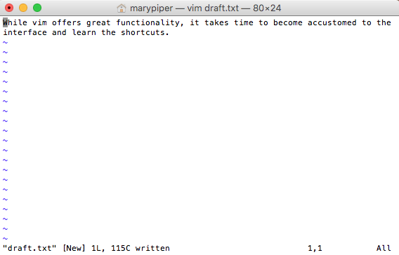
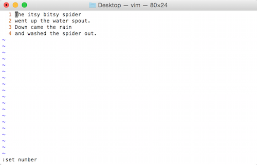

Approximate time: 30 min

## Learning Objectives

* Examine the contents of files
* Create a new file using the Vim text editor
* Learn basic operations using the Vim text editor

## Examining Files

We now know how to move around the file system and look at the contents of directories, but how do we look at the contents of files? On your laptop, viewing a file is as simple as finding it in the file explorer window and double clicking to open it. As you will have noticed so far, the point and click of the mouse is not very useful when working on the command-line. Instead we will need to equip ourseleves with some helpful commands.

### `cat` command

The easiest way to examine a file is to just print out all of its contents using the command `cat`. We can test this out by printing the contents of `~/unix_lesson/other/sequences.fa`. Enter the command followed by the filename, including the path when necessary:

```bash
$ cat ~/unix_lesson/other/sequences.fa
```

The `cat` command prints out the all the contents of `sequences.fa` to the screen.

> `cat` stands for catenate; it has many uses and printing the contents of a files onto the terminal is one of them.

**What does this file contain?**

```bash

>SRR014849.1 EIXKN4201CFU84 length=93 
GGGGGGGGGGGGGGGGCTTTTTTTGTTTGGAACCGAAAGGGTTTTGAATTTCAAACCCTTTTCGGTTTCCAACCTTCCAAAGCAATGCCAATA

>gi|340780744|ref|NC_015850.1| Acidithiobacillus caldus SM-1 chromosome, complete genome
ATGAGTAGTCATTCAGCGCCGACAGCGTTGCAAGATGGAGCCGCGCTGTGGTCCGCCCTATGCGTCCAACTGGAGCTCGTCACGAG
TCCGCAGCAGTTCAATACCTGGCTGCGGCCCCTGCGTGGCGAATTGCAGGGTCATGAGCTGCGCCTGCTCGCCCCCAATCCCTTCG
TCCGCGACTGGGTGCGTGAACGCATGGCCGAACTCGTCAAGGAACAGCTGCAGCGGATCGCTCCGGGTTTTGAGCTGGTCTTCGCT
CTGGACGAAGAGGCAGCAGCGGCGACATCGGCACCGACCGCGAGCATTGCGCCCGAGCGCAGCAGCGCACCCGGTGGTCACCGCCT
CAACCCAGCCTTCAACTTCCAGTCCTACGTCGAAGGGAAGTCCAATCAGCTCGCCCTGGCGGCAGCCCGCCAGGTTGCCCAGCATC
CAGGCAAATCCTACAACCCACTGTACATTTATGGTGGTGTGGGCCTCGGCAAGACGCACCTCATGCAGGCCGTGGGCAACGATATC
CTGCAGCGGCAACCCGAGGCCAAGGTGCTCTATATCAGCTCCGAAGGCTTCATCATGGATATGGTGCGCTCGCTGCAACACAATAC
CATCAACGACTTCAAACAGCGTTATCGCAAGCTGGACGCCCTGCTCATCGACGACATCCAGTTCTTTGCGGGCAAGGACCGCACCC

>gi|129295|sp|P01013|OVAX_CHICK GENE X PROTEIN (OVALBUMIN-RELATED)
QIKDLLVSSSTDLDTTLVLVNAIYFKGMWKTAFNAEDTREMPFHVTKQESKPVQMMCMNNSFNVATLPAE

```

### `less` command

`cat` is a terrific command, but when the file is really big, it can be annoying to use. In practice, when you are running your analyses on the command-line you will most likely be dealing with large files. In our case, we have FASTQ files. Let's take a look at the list of raw_fastq files and add the `-h` modifier to see how big the files are. 

```bash
$ ls -lh ~/unix_lesson/raw_fastq
```

> The `ls` command has a modifier `-h` when paired with `-l`, will list the files and also print sizes of files in human readable format. 

In the fourth column you wll see the size of each of these files, and you can see they are quite large, so we probably do not want to use the `cat` command to look at them. Instead, we can use the `less` command. 

Move into our `raw_fastq` directory and enter the following command:

```bash
$ less Mov10_oe_1.subset.fq
```
Rather than printing to screen, the `less` command opens the file in a new buffer allowing you to navigate through it. Does this look familiar? You might remember encountering a similar interface when you used the `man` command. This is because `man` is using the `less` command to open up the documentation files! The keys used to move around the file are identical to the `man` command. Below we have listed some additional shortcut keys for naviagting through your file when using `less`.

<span class="caption">Shortcuts for `less`</span>

| key              | action                 |
| ---------------- | ---------------------- |
| <kbd>SPACE</kbd> | to go forward          |
| <kbd>b</kbd>     | to go backwards        |
| <kbd>g</kbd>     | to go to the beginning |
| <kbd>G</kbd>     | to go to the end       |
| <kbd>q</kbd>     | to quit                |


Use the shortcut keys to move through your FASTQ file, we will explore these files in more detail later in the workshop. 

`less` also gives you a way of searching through files. Just hit the <kbd>/</kbd> key to begin a search. Enter the name of the string of characters you would like to search for and hit enter. It will jump to the next location where that string is found. If you hit <kbd>/</kbd> then <kbd>ENTER</kbd>, `less` will just repeat the previous search. `less` searches from the current location and works its way forward. If you are at the end of the file and search for the word "cat", `less` will not find it. You need to go to the beginning of the file and search.

For instance, let's search for the sequence `GAGACCC` in our file. You can see that we go right to that sequence and can see what it looks like. To exit hit <kbd>q</kbd>. There are other more sophisticated commands to search through your file (and we will cover these later), but this shortcut search is useful for a quick scan through. You can think of it as being analagous to using the <kbd>Ctrl-F</kbd> keystroke when searching on your laptop.


### `head` and `tail` commands

There's another way that we can look at files, and just look at part of them. In particular, if we just want to see the beginning or end of the file to see how it's formatted.

The commands are `head` and `tail` and they just let you look at the beginning and end of a file respectively.

```bash
$ head Mov10_oe_1.subset.fq
```

```bash
$ tail Mov10_oe_1.subset.fq
```

By default the first or last 10 lines will be printed to screen. The `-n` option can be used with either of these commands to specify the number `n` lines of a file to display. For example, let's print the first/last line of the file:

```bash
$ head -n 1 Mov10_oe_1.subset.fq

$ tail -n 1 Mov10_oe_1.subset.fq
```


## Writing files

We've been able to do a lot of work with files that already exist, but what if we want to write our own files. Obviously, we're not going to type in a FASTA file, but you'll see as we go, there are a lot of reasons we'll want to write/create a file or edit an existing file.

To create or edit files we will need to use a **text editor**. When we say, "text editor," we really do mean "text": these editors can
only work with plain character data, not tables, images, or any other
media. The types of text editors available can generally be grouped into **graphical user interface (GUI) text editors** and **command-line editors**.

### GUI text editors

A GUI is an interface that has buttons and menus that you can click on to issue commands to the computer and you can move about the interface just by pointing and clicking. You might be familar with GUI text editors, such as [TextWrangler](http://www.barebones.com/products/textwrangler/), [Sublime](http://www.sublimetext.com/), and [Notepad++](http://notepad-plus-plus.org/), which allow you to write and edit plain text documents. These editors often have features to easily search text, extract text, and highlight syntax from multiple programming languages. They are great tools, but since they are 'point-and-click', we cannot efficiently use them from the command line remotely on a compute cluster.

### Command-line editors

When working remotely, we need a text editor that functions from the command line interface. Within these editors, since you cannot 'point-and-click', you must navigate the interface using the arrow keys and shortcuts. 

While there are simpler editors available for use (i.e. [nano](http://www.nano-editor.org/)), most computational scientists tend to favor editors that have greater functionality. Some popular editors include [Emacs](http://www.gnu.org/software/emacs/), [Vim](http://www.vim.org/), or a graphical editor such as [Gedit](http://projects.gnome.org/gedit/). These are editors which are generally available for use on high-performance compute clusters.

### Introduction to Vim 

To write and edit files, we're going to use a text editor called 'Vim'. Vim is a very powerful text editor, and it offers extensive text editing options. However, in this introduction we are going to focus on exploring some of the more basic functions. There is a lot of functionality that we are not going to cover during this session, but encourage you to go further as you become more comfortable using it. To help you remember some of the keyboard shortcuts that are introduced below and to allow you to explore additional functionality on your own, we have compiled a [cheatsheet](https://github.com/hbctraining/In-depth-NGS-Data-Analysis-Course/blob/master/resources/VI_CommandReference.pdf).


### Vim Interface

You can create a document by calling a text editor and providing the name of the document you wish to create. Change directories to the `unix_lesson/other` folder and create a document using `vim` entitled `draft.txt`:

```bash
$ cd ~/unix_lesson/other
	
$ vim draft.txt
```

Notice the `"draft.txt" [New File]` typed at the bottom left-hand section of the screen. This tells you that you just created a new file in vim. 


### Vim Modes
Vim has **_two basic modes_** that will allow you to create documents and edit your text:   

- **_command mode (default mode):_** will allow you to save and quit the program (and execute other more advanced commands).  

- **_insert (or edit) mode:_** will allow you to write and edit text


Upon creation of a file, vim is automatically in command mode. Let's _change to insert mode_ by typing <kbd>i</kbd>. Notice the `--INSERT--` at the bottom left hand of the screen. Now type in a few lines of text:



After you have finished typing, press <kbd>esc</kbd> to enter command mode. Notice the `--INSERT--` disappeared from the bottom of the screen.

### Vim Saving and Quitting
To **write to file (save)**, type <kbd>:w</kbd>. You can see the commands you type in the bottom left-hand corner of the screen. 



After you have saved the file, the total number of lines and characters in the file will print out at the bottom left-hand section of the screen.



Alternatively, we can **write to file (save) and quit**. Let's do that by typing <kbd>:wq</kbd>. Now, you should have exited vim and returned back to your terminal window.

To edit your `draft.txt` document, open up the file again by calling vim and entering the file name: `vim draft.txt`. Change to insert mode and type a few more lines (you can move around the lines using the arrows on the keyboard). This time we decide to **quit without saving** by typing <kbd>:q!</kbd>
 


### Vim Editing
Create the document `spider.txt` in vim. Enter the text as follows: 


To make it easier to refer to distinct lines, we can add line numbers by typing <kbd>:set number</kbd>. **Save the document.** Later, if you choose to remove the line numbers you can type <kbd>:set nonumber</kbd>.



While we cannot point and click to navigate the document, we can use the arrow keys to move around. Navigating with arrow keys can be very slow, so Vim has shortcuts (which are completely unituitive, but very useful as you get used to them over time). Check to see what mode you are currently in. While in command mode, try moving around the screen and familarizing yourself with some of these shortcuts:    

| key              | action                 |
| ---------------- | ---------------------- |
| <button>gg</button>     | to move to top of file |
| <button>G</button>     | to move to bottom of file     |
| <button>$</button>     | to move to end of line |
| <button>0</button>     | to move to beginning of line     |
| <button>w</button>     | to move to next word     |
| <button>b</button>     | to move to previous word     |


In addition to shortcuts for navigation, vim also offers editing shortcuts such as:

| key              | action                 |
| ---------------- | ---------------------- |
| <button>dw</button>     | to delete word |
| <button>dd</button>     | to delete line     |
| <button>u</button>     | to undo |
| <button>Ctrl + r</button>     | to redo     |
| <button>/*pattern*</button>     | to search for a pattern (*n/N* to move to next/previous match)    |
| <button>:%s/*search*/*replace*/g</button>     | to search for a pattern and replace for all occurences     |

Practice some of the editing shortcuts, then quit the document without saving any changes.

*** 

**Exercise**

We have covered some basic commands in vim, but practice is key for getting comfortable with the program. Let's
practice what we just learned in a brief challenge.

1. Open `spider.txt`, and delete the word "water" from line #2.
2. Quit without saving.
3. Open `spider.txt` again, and replace every occurrence of "spider" with "unicorn".
4. Delete: "Down came the rain." 
5. Save the file.
6. Undo your previous deletion.
7. Redo your previous deletion.
8. Delete the first and last words from each of the lines.
9. Save the file and see whether your results match your neighbors.

***

### Overview of vim commands

**Vim modes:**

| key              | action                 |
| ---------------- | ---------------------- |
| <button>i</button>     | insert mode - to write and edit text |
| <button>esc</button>     | command mode - to issue commands / shortcuts  |


**Saving and quiting:**

| key              | action                 |
| ---------------- | ---------------------- |
| <button>:w</button>     | to write to file (save) |
| <button>:wq</button>     | to write to file and quit     |
| <button>:q!</button>     | to quit without saving |


**Shortcuts for navigation:**

| key              | action                 |
| ---------------- | ---------------------- |
| <button>gg</button>     | to move to top of file |
| <button>G</button>     | to move to bottom of file     |
| <button>$</button>     | to move to end of line |
| <button>0</button>     | to move to beginning of line     |
| <button>w</button>     | to move to next word     |
| <button>b</button>     | to move to previous word     |

**Shortcuts for editing:**

| key              | action                 |
| ---------------- | ---------------------- |
| <button>dw</button>     | to delete word |
| <button>dd</button>     | to delete line     |
| <button>u</button>     | to undo |
| <button>Ctrl + r</button>     | to redo     |
| <button>:set number</button>     | to number lines |
| <button>:set nonumber</button>     | to remove line numbers    |
| <button>/pattern</button>     | to search for a pattern (*n/N* to move to next/previous match)    |
| <button>:%s/search/replace/g</button>     | to search for a pattern and replace for all occurences     |	

---

*This lesson has been developed by members of the teaching team at the [Harvard Chan Bioinformatics Core (HBC)](http://bioinformatics.sph.harvard.edu/). These are open access materials distributed under the terms of the [Creative Commons Attribution license](https://creativecommons.org/licenses/by/4.0/) (CC BY 4.0), which permits unrestricted use, distribution, and reproduction in any medium, provided the original author and source are credited.*
